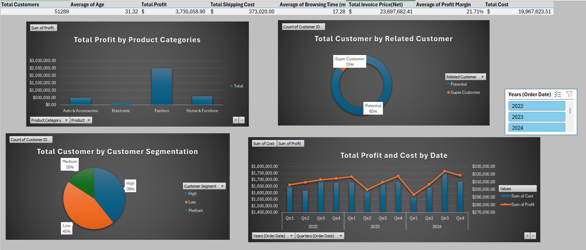

# E-commerce-data-analysis
This project was developed to identify low profit margins and optimize marketing strategies by segmenting highly engaged customers.

---

---

## Main Results
* Customer Migration Strategy: Currently, only 15% of our customer base qualifies as 'Super Customers' (High-profit & High-engagement). To drive growth, marketing efforts should focus on migrating 'Low-profit' and 'Potential' segments into 'Medium/High' brackets through targeted loyalty programs.
* Engagement Driving: Since high interaction (likes, shares, and cart additions) correlates with customer value, gamified social media campaigns should be implemented to encourage these behaviors in underperforming segments.
* Fashion: As the highest-profit category, inventory levels must be optimized to prevent stockouts and maximize seasonal revenue.
* Electronics: This category is currently underperforming in terms of net profit. A strategic review is recommended to decide between optimizing operational costs (e.g., shipping) or pivoting to more profitable tech-related niches.
* Seasonal Planning: Data indicates a strong sales surge in Q3 and Q4. To balance the annual revenue stream, aggressive 'Early Bird' campaigns and brand awareness advertisements should be prioritized during the slower Q1 and Q2 periods.

---

## Tools & Technologies

* Pivot Tables
* Charts
* Tables, Named Ranges, Conditional Formatting
* Logical Expressions
* Nested If's

---

## Project Workflow & Methodology
1. Data Acquisition & Initial Preparation (ETL)
Data Ingestion: Raw data was imported from a CSV source into a structured Excel environment.

Environment Setup: Created a multi-layered workbook structure (Source, Exploration, Calculation, and Dashboard) to maintain data integrity and separate the "raw" data from "processed" insights.

2. Data Cleaning & Exploration (EDA)
Structural Organization: Applied Excel Tables and Named Ranges to ensure dynamic data referencing.

Missing Value Treatment: * Categorical Data: Blank cells in text-based columns were labeled as "Not Data" for transparency.

Numerical Data: Retained blank cells in currency and numeric fields to prevent calculation bias.

Exploratory Analysis: Calculated baseline metrics including Total Customer Count, Average Age, Sales, Quantity, and Browsing Time. Interaction metrics (Likes, Shares, Add to Cart) were aggregated to understand baseline engagement.

3. Feature Engineering & Financial Modeling
Derived Columns: Developed custom formulas to calculate:

Total Sales: Gross revenue per transaction.

Net Sales: Revenue after accounting for discounts.

Invoice Price: Final price including shipping costs.

Cost of Goods Sold (COGS): Derived from sales and profit data.

Profitability Metrics: Calculated Profit Margin (%) for every transaction and applied Conditional Formatting to highlight high-margin vs. loss-making orders.

4. Advanced Customer Segmentation
Profit-Based Tiers: Segmented customers into High, Medium, and Low profit categories using nested logical functions.

Behavioral Segmentation: Created a "Super Customer" scoring model by combining profitability with engagement triggers (Likes, Shares, and Cart additions). Customers not meeting these criteria were categorized as "Potential" for future conversion.

5. Data Visualization & Reporting (Deliverables)
Dynamic Pivot Tables: Summarized complex datasets to identify trends in product categories and seasonal performance.

Interactive Dashboard: Built a professional dashboard featuring:

Executive KPIs: High-level summaries of Total Sales, Average Margin, and Super Customer counts.

Interactive Slicers: Allowing users to filter data by segment and category in real-time.

Insight Communication: Documented strategic recommendations in a final "Results" report based on quarterly trends and category performance.

---

## Sources

* Supermarket_Sales.csv in datasource
* dashboard.png in dashboard

